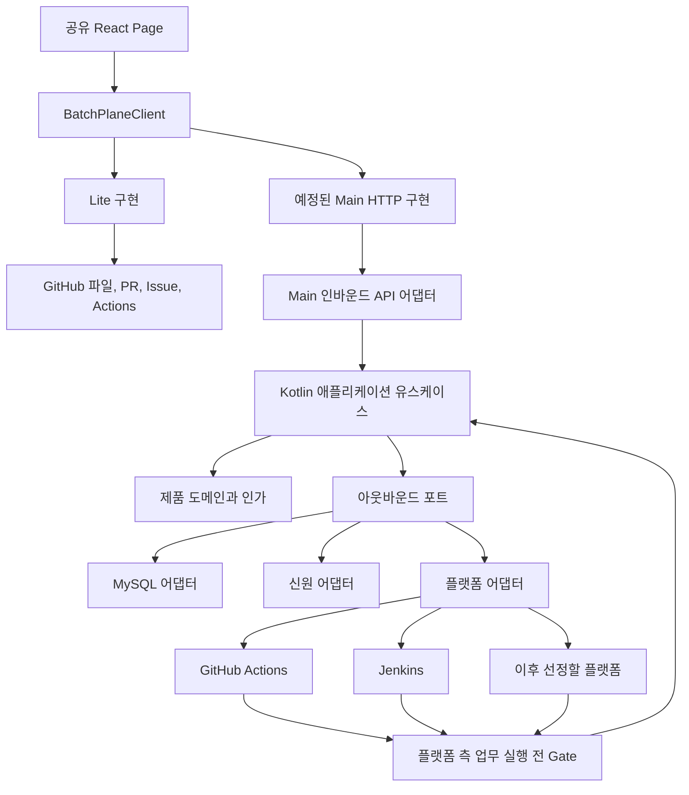

# BatchPlane 통제 플랫폼 아키텍처

[English](./control-plane-architecture.md)

상태: 수용된 방향, 현재 Lite 경계와 예정된 Main 설계.
2026-10-05 정합화. 구체적인 Main 계약은 #227 승인이 필요하다.

## 아키텍처 결정

Main은 헥사고날 의존 경계와 MySQL을 사용하는 Kotlin/Spring Boot 모듈형
모놀리스다. Lite는 GitHub를 기반으로 하는 TypeScript 서버리스 런타임이다.
둘은 같은 React UI 소스와 제품 의미를 사용하지만 권한 판단 주체, 저장 구현,
배포물까지 같은 것은 아니다.

[ADR-0001](./adr/0001-modular-monorepo.ko.md)에 따라 소스 저장소 하나를 유지한다.
두 에디션은 상대 에디션의 런타임 구현을 가져오지 않는다. UI 소스 트리를 따로
만들지 않는다.

## 전체 구성



그림의 Main과 커넥터는 계획이며 설치된 서비스가 아니다. 실제 Lite Gate는
native 실행 안에서 저장소 증적을 검증한다. 숨겨진 BatchPlane 서버를 호출하지 않는다.

## 권한과 실행 소유권

Main은 제품 신원·인가·요청·결정·정규화된 관찰 상태·감사를 소유한다. 인증 사실은
환경별 어댑터가 제공하며 외부 그룹 소속 자체가 제품 권한은 아니다.

native 플랫폼은 스케줄러·runner·실행·로그를 소유한다. 플랫폼 어댑터는 관리와
관찰을 변환한다. 플랫폼 측 커넥터는 업무 전에 Gate를 강제한다. 업무 시작 후
폴링으로 이 경계를 대체할 수 없다.

현재 Lite는 저장소 기반 Workspace 하나를 연결한다. #142는 승인된 실현 가능성
설계에 따라 권한 기반 멀티 Workspace 조회와 통합 요청을 추가한다. 브라우저
세션이 저장소별 신뢰 경계를 없애지 않는다. Main은 한 Workspace에 여러 연결을
지원한다.

통합 요청서는 여러 Workspace를 대상으로 할 수 있으며 모든 대상에 권한이 있는
공통 승인자 한 명이 필요하다. 정확한 요청 저장 방식·저장소 간 증적·ID·부분 결과
계약은 이 그림으로 결정하지 않는다.

## 현재 저장소 구조

다음은 새 디렉터리 이전안이 아니라 현재 구조다.

```text
apps/web/src/
  app/                         라우팅과 조합
  pages/                       제품 Page와 소유 컴포넌트/Hook
  components/                  중립적인 공통 컨트롤과 시각 토큰
  client/                      제품 클라이언트 Context
  runtime/                     구현 주입
packages/
  ui-client/                   실제 TypeScript 제품 UI 계약
  github-lite/                 GitHub 전송, 증적, Lite 작업
  domain/                      현재 TypeScript 도메인 동작
  digest/                      정규 digest 구현
actions/
  dispatcher/                  승인된 수동 요청 전달
  gate/                        업무 실행 전 증적 검증
  schedule-request/            native 회차 기록
  schedule-result/             native 회차 결과 기록
```

이 경계는 이미 분리했다. #192가 R1-R7을 다시 시작하지 않는다. 패키지명과
메서드의 기준은 현재 소스다.

Main에는 승인된 첫 흐름에 필요한 패키지·모듈만 추가한다. 이후 Gradle 빌드는
pnpm과 공존할 수 있다. 정확한 모듈 트리는 #227/#228에서 설계한다. 업무 명사마다
별도 모듈, ui-kit 패키지, 생성형 클라이언트, 스키마 폼 엔진, 동적 plugin SDK를
이 문서가 강제하지 않는다.

## 헥사고날 의존 규칙

```text
인바운드 어댑터 -> 애플리케이션 유스케이스 -> 도메인
아웃바운드 어댑터 -> 애플리케이션이 선언한 포트
bootstrap -> 조합을 위한 구체 어댑터
React Page -> 제품 클라이언트 (플랫폼 전송 계층에 직접 의존하지 않음)
```

도메인 규칙은 Spring·SQL·HTTP·GitHub·Jenkins DTO에 의존하지 않는다.
애플리케이션 유스케이스는 권한과 외부 효과를 조정한다. 아웃바운드 포트는 실제
저장·신원·플랫폼 요구에 도입한다. 업무 책임으로 묶으며 읽기 쉬운 한 작업을
빈 계층이나 가상 인터페이스에 흩어 놓지 않는다.

## Main 저장과 외부 효과

MySQL은 제품 상태·과거 결정·감사를 저장한다. 트랜잭션 이후 상태 전이와 감사
기록이 불일치하면 안 된다. native 엔진 명령은 DB 트랜잭션에 함께 묶을 수 없으므로
의도를 기록하고 수락·확인된 실패·결과 불명을 구분한다.

outbox나 명시적으로 복구 가능한 오케스트레이션은 해당 경계의 후보이지 외부
효과의 exactly-once 보장이 아니다. #227/#228에서 최소 메커니즘·API·테이블을
승인한 뒤 구현한다. 이 기준선은 마이크로서비스, 이벤트 소싱 프레임워크,
범용 알림 인프라를 요구하지 않는다.

스케줄은 논리적으로 승인된 배치 형상에 속한다. Lite는 배치 정의에 내장한다.
Main은 스케줄을 독립 승인 대상으로 만들지 않으면서 관련 테이블/조회 모델로
검색할 수 있다. 테이블 구조는 Main 설계에서 결정한다.

## 완결된 통제 흐름

### 변경

정확한 제안 형상과 diff 요청 -> 유효 정책으로 인가 -> 현재 기준 형상 검증 ->
플랫폼에 반영 -> 반영된 형상 확인 -> 결과·감사 제공. 승인은 반영 성공의 증거가
아니다. 삭제된 배치 형상과 실행 참조에도 계속 접근할 수 있어야 한다.

### 수동 실행

정확한 대상·파라미터 요청 -> 승인 -> 통제된 전달 -> native 실행 시도 -> 필수
Gate -> 실제 승인된 업무 입력 -> 결과·로그·감사. 화면 허용 여부, 명령 인가와
Gate가 일치해야 한다.

확인된 전달 실패는 종결하며 새 요청이 필요하다. 결과 불명을 실패로 가정하거나
맹목적으로 재전송하지 않는다. 승인 후 철회와 실제 대기/실행 중 취소는
[로드맵](./control-plane-migration-plan.ko.md)의 상태별 흐름을 따른다.

### Native 스케줄

소유 배치·스케줄 형상 승인 -> native 플랫폼 트리거 -> 회차 기록 -> 권한/Gate
검증 -> 동일 native 실행에서 검증된 형상 수행 -> 실제 attempt/job 결과 연결.

정확한 증적 필드는 [구현된 Lite 스케줄 계약](./schedule-execution-contract.ko.md)이
정의한다. 같은 Run의 재실행을 거부하고 업무 진입 시 다시 확인한다. 서로 다른
native Run 사이의 예정 회차 중복 제거까지 약속하지는 않는다. 회차별 가짜 승인,
자동 몰아 실행, 자동 실행 재시도는 없다.

### 관찰과 취소

플랫폼 이벤트나 명시적 조회가 관찰 상태를 갱신한다. 결과 동기화는 시작·중단 없이
저장 상태를 보정한다. 취소는 사유와 함께 실제 플랫폼 명령을 전송하고 확인된
결과를 기록한다. UI에서만 종결 상태로 만들지 않는다. 둘 다 Main 첫 흐름에
속하며 Lite 취소는 #225다.

## 연동과 검증 순서

Lite 필수 흐름과 수용을 먼저 마친다. Main 기본 모델을 승인한 뒤 GitHub 등록·
수동 실행을 완결한다. 전체 Main 작업이 끝나기 전에 같은 Workspace의 실제
Jenkins를 곧바로 검증한다. 두 플랫폼에서 배운 뒤 세 번째를 선정하며 특정
세 번째 엔진을 가정하지 않는다.

의미 있는 곳에서 TypeScript와 Kotlin의 승인된 공통 제품 정책 fixture를 재사용한다.
런타임 간 컴파일된 구현 공유를 강제하거나 React에 업무 규칙을 복제하지 않는다.
플랫폼별 데이터와 강제되는 제약은 어댑터·지원 문서에 둔다.

## 설계와 증거 링크

- [작업 순서와 남은 범위 결정](./control-plane-migration-plan.ko.md)
- [요구사항과 준비 상태](./requirements-traceability.ko.md)
- [도메인 개념](./domain-model.ko.md)
- [신원과 권한](./identity-and-authorization.ko.md)
- [플랫폼 연동 설계 후보](./platform-provider-contract.ko.md)
- [Gate 의미와 제안 경계](./gate-protocol.ko.md)
- [공유 UI와 현재 사이트맵](./control-plane-ui-architecture.ko.md)
- [에디션 정합성](./main-lite-conformance.ko.md)
- [사용자 QA](./user-qa.ko.md)

아키텍처 문서는 실환경 수용을 증명하지 않는다. 런타임 패키징, 커넥터 인증,
Main 스키마/API·권한 매핑·배포 대상은 여전히 설계 작업이며 숨은 구현 결정이 아니다.
