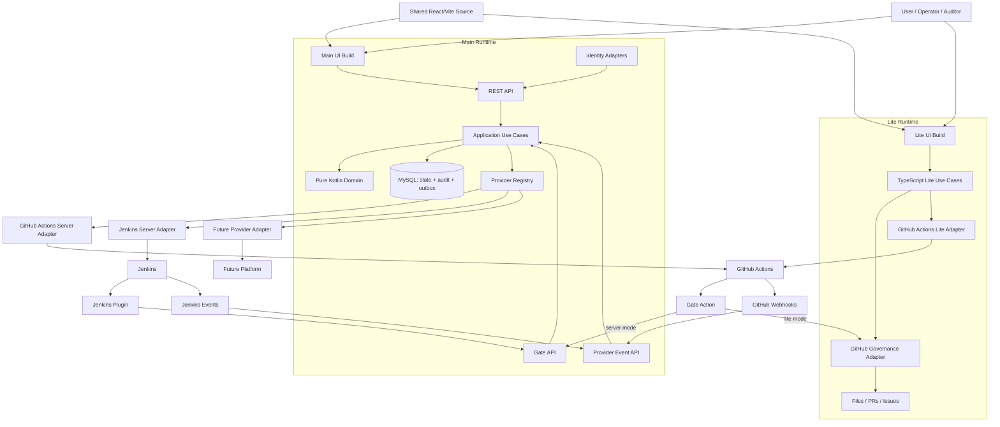
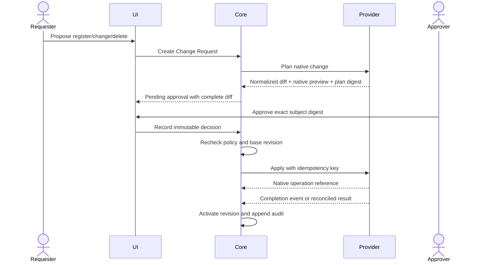
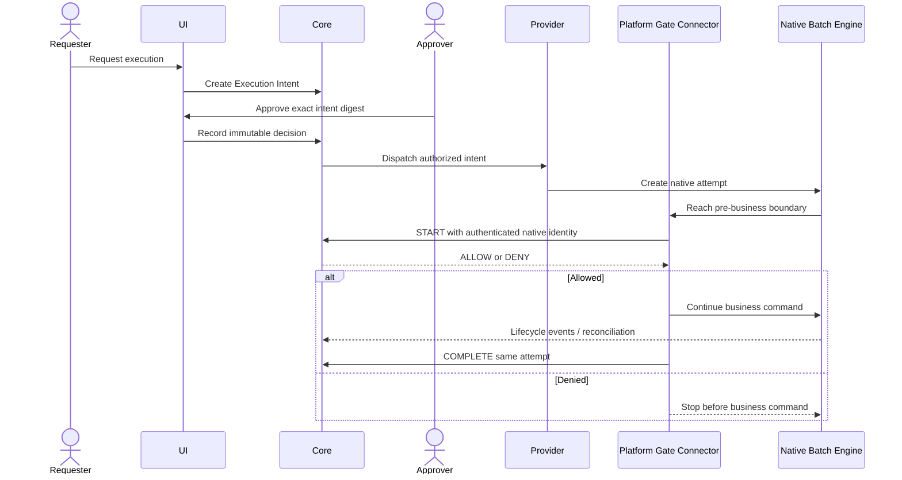
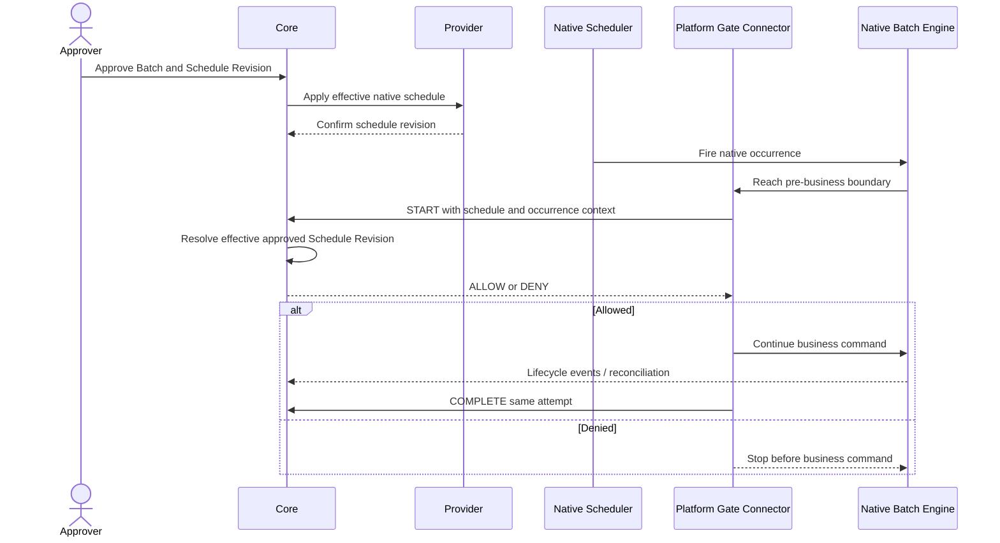

# BatchPlane Control Plane Architecture

Status: Architecture baseline for issue #191

## Architecture Decision

BatchPlane Main is a Kotlin/Spring Boot modular monolith using hexagonal
boundaries. BatchPlane Lite is a TypeScript serverless runtime. Both editions
share product contracts and React UI source, but they do not share an authority
or persistence implementation.

The architecture uses one product, two runtime editions, and multiple Platform
Provider Bundles.

## System Context



## Runtime Ownership

### Main

Main owns product state, identity mapping, internal authorization, policy
evaluation, execution permits, normalized projections, audit events, provider
orchestration, reconciliation, notification outbox, and cross-provider views.

### Lite

Lite maps common product operations to GitHub repository primitives. Pull
Requests, Issues, comments, repository files, and workflow runs are storage and
transport mechanisms, not core domain types.

One private repository is one Lite governance trust boundary because its
repository token, policy files, branch protection, and Gate evidence are scoped
together. The Lite composition root may hold several volatile repository
sessions and provide Workspace switching or read-only portfolio aggregation.
Every mutation and authorization is still bound to one selected Workspace.

Treating multiple private repositories as one policy Workspace would require a
shared trusted authority and cross-repository credentials. That is a Main
deployment concern, not an implicit browser-side Lite capability.

### Batch Platform

Each platform owns its native resources, scheduler, execution engine, runners,
branching, downstream execution, native state, and logs. Platform-side Gate
connectors enforce BatchPlane decisions at the actual pre-business boundary.

## Repository And Main Module Structure

```text
apps/
  control-plane-server/
  web/                         shared React feature source
  web-main/                    Main composition and build entry
  web-lite/                    Lite composition and build entry

server/
  modules/
    workspace/
    catalog/
    governance/
    execution-control/
    scheduling/
    observation/
    failure-management/
    audit/
  adapters/
    inbound-rest/
    inbound-events/
    outbound-mysql/
    outbound-identity/
    outbound-secrets/
    outbound-notification/
  bootstrap/

packages/
  contracts/                   OpenAPI, JSON Schema, reason codes, fixtures
  ui-client/                   TypeScript BatchPlaneClient contract
  ui-kit/
  digest/

providers/
  sdk/
    spi/
    tck/
  github-actions/
    main-adapter/
    lite-adapter/
    gate-action/
    dispatcher-action/
  jenkins/
    main-adapter/
    gate-plugin/
```

The first implementation MAY keep current pnpm packages and add a Gradle build
alongside them. Root CI orchestrates pnpm and Gradle without making one language
toolchain responsible for the other.

## Dependency Rules

```text
adapter-in-*  ──→ application ──→ domain
adapter-out-* ──→ application ports
provider adapters ──→ provider SPI + contracts
bootstrap ──→ all concrete modules for composition only
web ──→ generated client contract, never Kotlin domain classes
lite runtime ──→ TypeScript product contract + GitHub adapter
```

- `domain` imports no Spring, persistence, GitHub, Jenkins, HTTP, or UI code.
- `application` imports domain and declares inbound use cases and outbound
  ports.
- inbound adapters translate REST/webhook messages to application commands.
- outbound adapters implement persistence, provider, identity, secret, audit,
  and notification ports.
- provider implementations do not import UI features.
- UI pages receive a `BatchPlaneClient` from application composition and do not
  read sessions or construct adapters directly.

Each `server/modules/*` Gradle module contains its own domain model,
application use cases, and declared ports. Cross-module calls use exported
application contracts or domain events; one module never reaches into another
module's persistence adapter.

## Application Modules

The modular monolith is divided by business capability, not technical layer
alone:

| Module             | Primary responsibility                                           |
| ------------------ | ---------------------------------------------------------------- |
| Workspace          | Workspace, membership, roles, policies, Platform Connections     |
| Catalog            | Batch discovery, onboarding, revision, drift, search projections |
| Governance         | Change Requests, Approval Cases, provider apply orchestration    |
| Execution Control  | Execution Intents, permits, dispatch, Gate start/complete        |
| Scheduling         | Schedule revisions, effective authority, occurrence correlation  |
| Observation        | Provider events, attempt state, reconciliation, logs metadata    |
| Failure Management | Failure cases, cause taxonomy, follow-up, manager review         |
| Audit              | Append-only event creation, search, export, evidence references  |
| Notification       | Outbox consumption and delivery-channel adapters                 |

Each capability may have `domain`, `application`, and adapter packages inside
its module while still enforcing the dependency direction above.

## Command And Query Separation

BatchPlane uses pragmatic command/query separation, not independent services.

- Commands load aggregates, enforce invariants, write current state, append
  audit events, and enqueue outbox records in one MySQL transaction.
- Queries read Workspace-scoped projections optimized for batch, run, failure,
  work-queue, and audit screens.
- Provider webhooks and reconciliation update projections through idempotent
  application commands.
- Full event sourcing is not required.

## MySQL Boundaries

One MySQL deployment may initially contain all Main tables:

```text
workspace / membership / role_binding / policy_revision
platform_connection / provider_capability / provider_health
batch / batch_revision / batch_external_ref / schedule_projection
change_request / approval_case / approval_decision / apply_attempt
execution_intent / execution_permit / execution_attempt / gate_decision
failure_case / failure_submission / failure_review
audit_event / audit_evidence_ref
outbox_event / inbox_deduplication
```

Responsibilities remain separate even when tables share a schema:

- Current-state tables may be updated under aggregate rules.
- Approval decisions, Gate decisions, audit events, and historical revisions are
  append-only through supported APIs.
- Outbox records are created in the state transaction and delivered later.
- Unique constraints enforce idempotency for command, provider event, native
  attempt, and Gate start/complete keys.

## Shared UI Composition

The shared information architecture and screen contract are defined in
[`control-plane-ui-architecture.md`](./control-plane-ui-architecture.md).

The same React source creates two configured builds:

```text
Main build: runtime.kind=server-api, API base URL configured
Lite build: runtime.kind=github-lite, GitHub session adapter configured
```

At application startup:

```typescript
type BatchPlaneClient = {
  session: SessionClient;
  workspaces: WorkspaceClient;
  platformConnections: PlatformConnectionClient;
  batches: BatchClient;
  changes: ChangeRequestClient;
  approvals: ApprovalClient;
  executions: ExecutionClient;
  schedules: ScheduleClient;
  failures: FailureClient;
  audit: AuditClient;
  capabilities: CapabilityClient;
};
```

This client is injected through application context. Feature pages never select
Main versus Lite or GitHub versus Jenkins themselves.

## Provider Event Flow

Platform integration is bidirectional:

```text
BatchPlane command
  -> provider control adapter
  -> native platform operation
  -> native operation ID recorded

Native platform event
  -> authenticated webhook/plugin/event adapter
  -> inbox deduplication
  -> normalized application command
  -> attempt/projection/audit update
```

Polling is a reconciliation fallback, not the primary source when reliable
events exist. Late or repeated events are expected and processed idempotently.

## End-To-End Control Flows

The following sequences describe product semantics. Main persists the Core
steps in MySQL; Lite maps them to repository-native evidence.
In Lite sequence interpretation, `Core` means the product rules packaged into
the browser application service or Gate Action; it does not imply a hidden
BatchPlane server.

### Governed Change



An approval authorizes only the planned content. A provider operation can still
fail, conflict, or remain pending; the UI must not label the change effective
until the provider result is confirmed.

### Manual Or API Execution



In Lite, the manual dispatcher is part of the GitHub provider implementation.
In Main, the provider worker dispatches after committed authorization. Neither
path allows the browser to call the native execution API directly.

### Scheduled Execution



The schedule approval is the authority. The occurrence creates an Execution
Attempt and Gate decision, not a fabricated human or automatic approval.

## Deployment Units

Initial deployment units are:

- `batchplane-server`: Kotlin application and Main UI static build.
- `batchplane-mysql`: externally managed or bundled MySQL deployment.
- `batchplane-worker`: optional separate process later; initially the server may
  execute outbox workers under the same codebase.
- `batchplane-lite`: static Lite UI build.
- `batchplane-gate-action`: published GitHub Action supporting Lite and Server
  modes.
- `batchplane-dispatcher-action`: Lite dispatcher.
- `batchplane-jenkins-plugin`: Jenkins enforcement and lifecycle connector.

Splitting Main into microservices requires measured scaling, availability, or
ownership pressure and a new architecture decision. It is not part of the
initial design.

## Architecture Enforcement

- Gradle module dependencies and ArchUnit tests enforce Kotlin boundaries.
- ESLint import rules enforce UI, Lite application, and adapter boundaries.
- OpenAPI and JSON Schema compatibility checks run in CI.
- The Adapter TCK runs against provider simulators and integration fixtures.
- A dependency report MUST fail CI when core domain code imports provider-
  specific packages.
