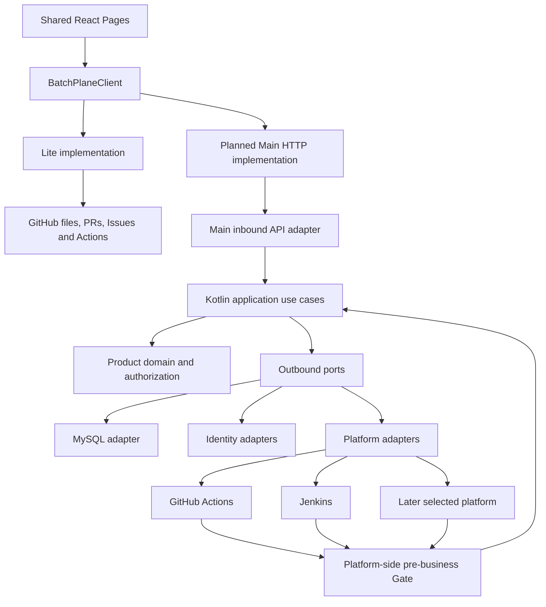

# BatchPlane Control Plane Architecture

Status: Accepted direction; current Lite boundary and planned Main design.
Reconciled 2026-10-05. Concrete Main contracts require #227 approval.

## Architecture Decision

Main is a Kotlin/Spring Boot modular monolith using hexagonal dependency
boundaries and MySQL. Lite is a TypeScript serverless runtime backed by GitHub.
Both use the same React UI source and product semantics, not the same authority,
storage implementation or deployment artifact.

One source repository is retained under
[ADR-0001](./adr/0001-modular-monorepo.md). Neither edition imports the other's
runtime implementation. Do not create separate UI source trees.

## Context


```mermaid
flowchart TB
    UI[Shared React Pages] --> CLIENT[BatchPlaneClient]
    CLIENT --> LITE[Lite implementation]
    CLIENT --> HTTP[Planned Main HTTP implementation]
    LITE --> GH[GitHub files, PRs, Issues and Actions]
    HTTP --> API[Main inbound API adapter]
    API --> APP[Kotlin application use cases]
    APP --> DOMAIN[Product domain and authorization]
    APP --> PORTS[Outbound ports]
    PORTS --> DB[MySQL adapter]
    PORTS --> IDENTITY[Identity adapters]
    PORTS --> PROVIDERS[Platform adapters]
    PROVIDERS --> GHA[GitHub Actions]
    PROVIDERS --> JENKINS[Jenkins]
    PROVIDERS --> NEXT[Later selected platform]
    GHA --> GATE[Platform-side pre-business Gate]
    JENKINS --> GATE
    NEXT --> GATE
    GATE --> APP
```

Main and its connectors in this diagram are planned, not installed services.
The actual Lite Gate verifies repository evidence inside the native execution.
It does not call a hidden BatchPlane server.

## Authority And Execution Ownership

Main owns product identity, authorization, requests, decisions, normalized
observations and audit. Authentication facts come from environment adapters;
external group membership is not itself a product permission.

Native platforms own schedulers, runners, execution and logs. Platform adapters
translate management and observation. A platform-side connector enforces Gate
before business work. Polling after work starts cannot replace that boundary.

Lite currently connects one repository-backed Workspace. #142 adds authorized
multi-Workspace reads and unified requests, subject to an approved feasibility
design. A browser session does not erase separate repository trust boundaries.
Main supports multiple connections inside one Workspace.

A unified request can cover several Workspaces and requires one common approver
authorized for every target. Exact request storage, cross-repository evidence,
IDs and partial-result contracts are not decided by this diagram.

## Current Repository, Not A New Directory Migration

```text
apps/web/src/
  app/                         routing and composition
  pages/                       product Pages and owned components/Hooks
  components/                  neutral shared controls and visual tokens
  client/                      product-client Context
  runtime/                     implementation injection
packages/
  ui-client/                   actual TypeScript product UI contract
  github-lite/                 GitHub transport, evidence and Lite operations
  domain/                      current TypeScript domain behavior
  digest/                      canonical digest implementation
actions/
  dispatcher/                  approved manual-request delivery
  gate/                        pre-business evidence verification
  schedule-request/            native occurrence record
  schedule-result/             native occurrence outcome record
```

These boundaries have already been extracted. R1-R7 are not restarted by #192.
Current source is authoritative for package names and methods.

Main adds only the packages/modules needed for its approved first flow.
A future Gradle build can coexist with pnpm. The exact module tree is designed
in #227/#228; this document does not mandate a separate module per business noun,
a ui-kit package, generated client, schema form engine or dynamic plugin SDK.

## Hexagonal Dependency Rules

```text
inbound adapters -> application use cases -> domain
outbound adapters -> application-declared ports
bootstrap -> concrete adapters for composition
React Pages -> product client, not provider transport
```

Domain rules do not depend on Spring, SQL, HTTP, GitHub or Jenkins DTOs.
Application use cases coordinate authorization and side effects. Outbound ports
are introduced for real persistence, identity and platform needs. Group by
business responsibility; do not distribute one readable operation among empty
layers or speculative interfaces.

## Main Persistence And Side Effects

MySQL stores product state, historical decisions and audit. State transition and
its audit record must not disagree after a transaction. Native engine commands
cannot share the database transaction; record intent and distinguish accepted,
confirmed failed and unknown outcomes.

An outbox or explicit recoverable orchestration is a candidate for that boundary,
not a claim of exactly-once external effects. #227/#228 approve the minimum
mechanism, API and tables before implementation. No microservices, event-sourcing
framework or general notification infrastructure is required by this baseline.

Schedules are logically owned by the approved Batch revision. Lite embeds them
in that definition. Main may query a related schedule table/projection without
making a schedule independently approvable. Table shape belongs to Main design.

## Complete Control Flows

### Change

Request exact proposed configuration and diff -> authorize under effective
policy -> verify current base -> apply through provider -> confirm resulting
revision -> expose result and audit. Approval is not proof that apply succeeded.
Deleted Batch revisions and execution references remain accessible.

### Manual Execution

Request exact target and parameters -> approval -> controlled delivery ->
native attempt -> mandatory Gate -> actual approved business inputs ->
result, logs and audit. UI capability, command authorization and Gate must agree.

Confirmed dispatch failure is terminal and requires a new request. Unknown
delivery is not assumed failure and does not trigger blind retransmission.
Approved withdrawal and real queued/running cancellation use the state-specific
flow in [the roadmap](./control-plane-migration-plan.md).

### Native Schedule

Approve the owning Batch/schedule revision -> native platform fires ->
record occurrence -> verify authority/Gate -> execute from the verified revision
in the same native execution -> correlate the actual attempt/job result.

The [implemented Lite schedule contract](./schedule-execution-contract.md) owns
exact evidence fields. It denies same-Run reruns and rechecks at business entry;
it does not promise nominal-slot deduplication across distinct native Runs.
No per-occurrence fake approval, automatic catch-up or automatic execution retry.

### Observation And Cancellation

Provider events or explicit reads update observations. Result synchronization
repairs stored state without starting/stopping work. Cancellation sends an actual
provider command with a reason and records the confirmed result, not a UI-only
terminal state. Both belong to Main's first flow; Lite cancellation is #225.

## Integration And Validation Order

Complete required Lite flows and acceptance first. Approve Main's basic model,
then complete GitHub registration/manual execution. Validate real Jenkins in
the same Workspace immediately afterwards, before all Main operations are done.
Select a third platform after learning from those two; no specific third engine
is assumed.

Reuse approved product-policy fixtures across TypeScript and Kotlin where
meaningful. Do not require shared compiled implementation across runtimes or
duplicate business rules in React. Provider-specific data and enforced
limitations stay in adapters and support documentation.

## Design And Evidence Links

- [Delivery order and remaining scope decisions](./control-plane-migration-plan.md)
- [Requirements and readiness](./requirements-traceability.md)
- [Domain concepts](./domain-model.md)
- [Identity and authorization](./identity-and-authorization.md)
- [Provider design candidates](./platform-provider-contract.md)
- [Gate semantics and proposal boundary](./gate-protocol.md)
- [Shared UI and current sitemap](./control-plane-ui-architecture.md)
- [Edition conformance](./main-lite-conformance.md)
- [User QA](./user-qa.ko.md)

Architecture documents do not establish live acceptance. Runtime packaging,
connector authentication, Main schema/API, Main permission mappings and deployment
targets remain design work, not hidden implementation decisions.
