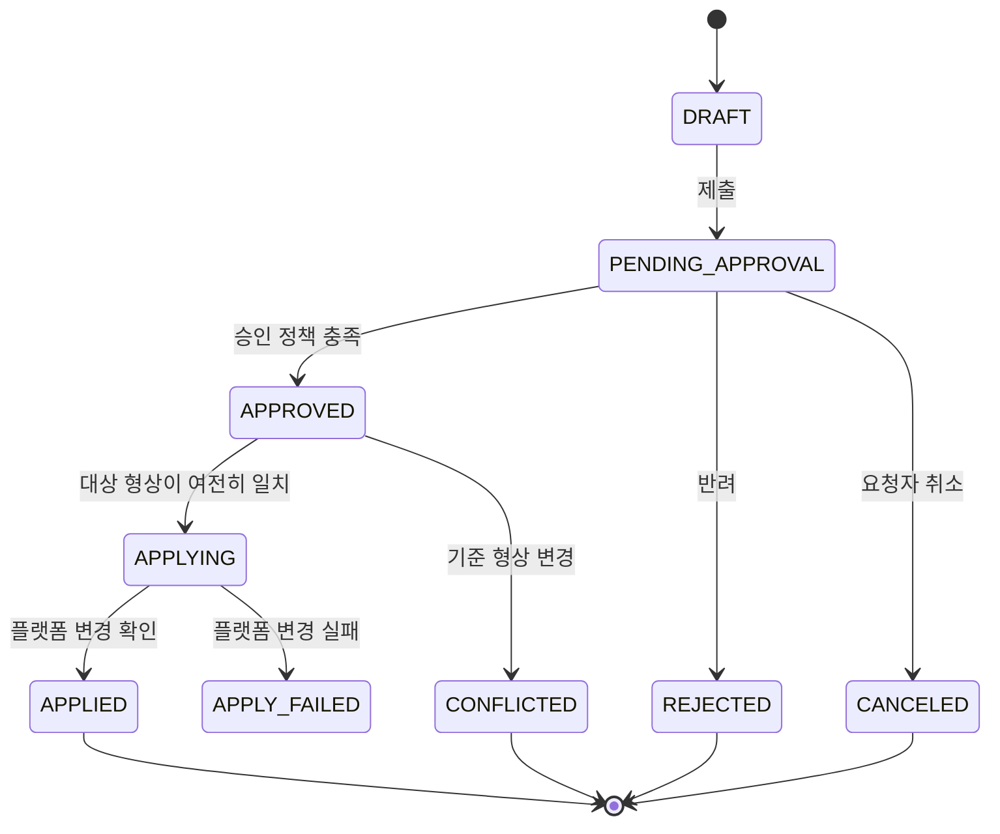
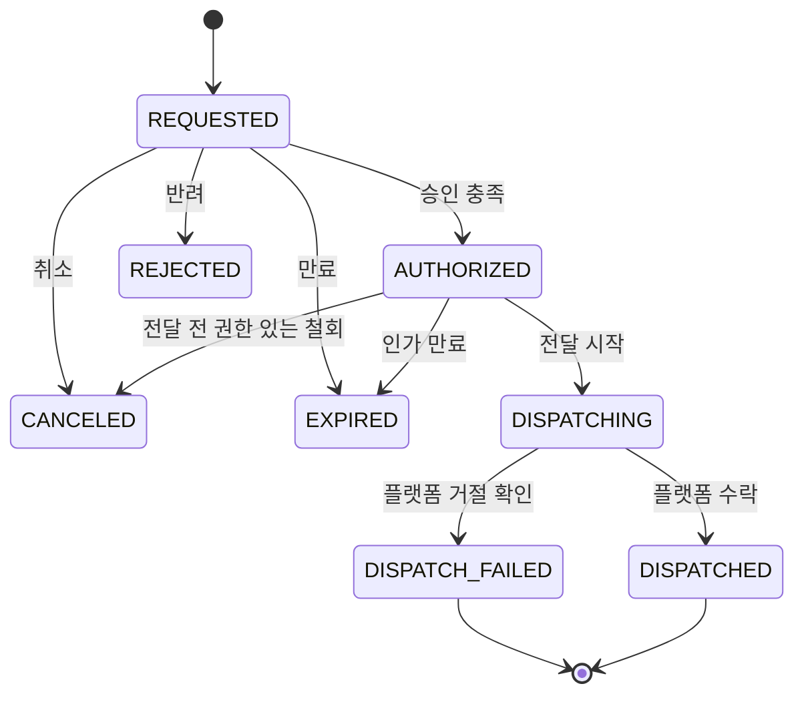
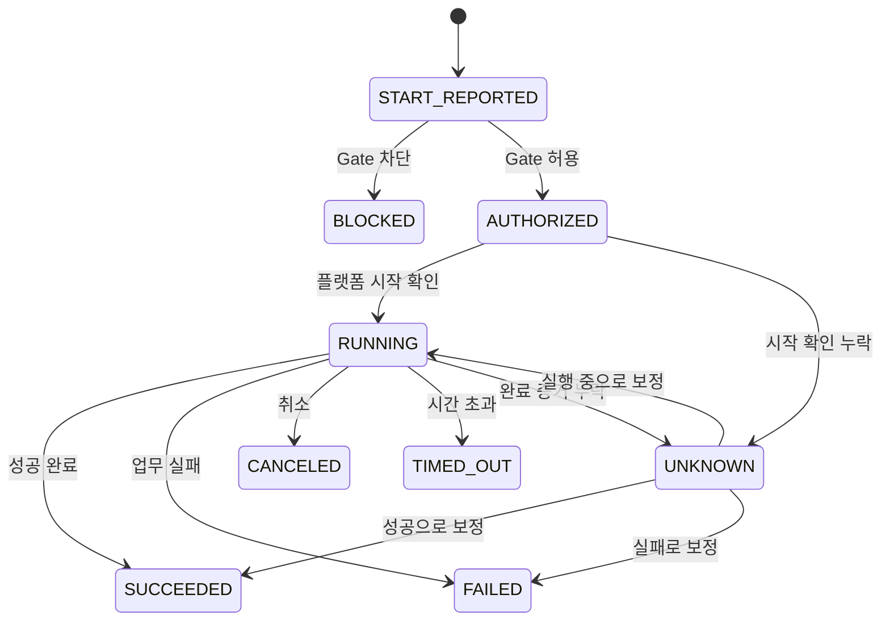
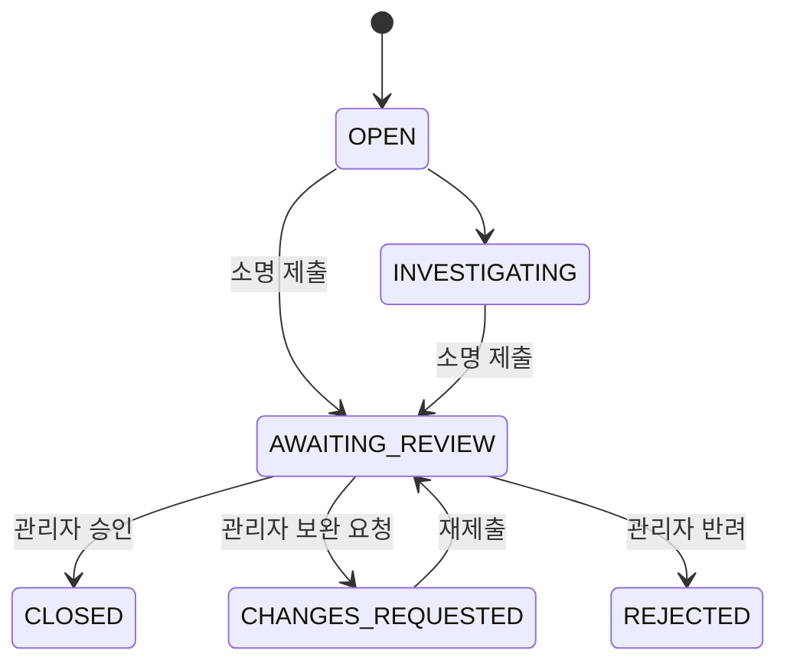

# BatchPlane 도메인 모델

[English](./domain-model.md)

상태: 2026-10-05 정합화한 개념 모델. 아래 Main aggregate 이름·필드·상태 enum·ID·
테이블 경계는 설계 후보이며 출시된 API/스키마가 아니다. Main 구현 전에 #227에서
구체 모델을 승인한다. 예시 구조보다 승인된 제품 의미와 현재 Lite 구현이 우선한다.
[요구사항 추적표](./requirements-traceability.ko.md)를 참조한다.

## 모델링 원칙

- 핵심 타입은 GitHub·Jenkins 등 플랫폼 API 자원이 아니라 제품 의미를 설명한다.
- 요청/승인, native 변경, 실행 인가, 실행 시도, 실패 후속처리는 생명주기를 분리한다.
- 생명주기 간 연결을 명시한다. 하나의 거대한 workflow 상태 기계를 만들지 않는다.
- 과거 결정은 불변 형상·정책 스냅샷에 결합한다.
- 플랫폼 native 값은 타입이 있는 외부 참조와 스키마 버전이 있는 플랫폼 명세로 표현한다.

## 핵심 값 객체

| 값 객체                | 의미                                               |
| ---------------------- | -------------------------------------------------- |
| `WorkspaceId`          | 접근·정책 경계                                     |
| `PlatformConnectionId` | 구성된 플랫폼 설치 또는 엔드포인트 하나            |
| `ProviderKey`          | `github-actions`처럼 안정적으로 확장 가능한 문자열 |
| `BatchId`              | Workspace 안의 전역 제품 식별자                    |
| `BatchRevisionId`      | 통제 배치 내용의 불변 형상                         |
| `ExternalResourceRef`  | 플랫폼 키·연결·native 타입·native ID               |
| `RequestId`            | 통제 변경 또는 실행 요청의 연결 ID                 |
| `ApprovalCaseId`       | 승인 생명주기 식별자                               |
| `PolicyRevisionId`     | 결정 시 평가한 불변 정책                           |
| `ExecutionIntentId`    | 수동/API/상위 요청 실행의 식별자                   |
| `ExecutionPermitId`    | Main 실행을 위해 발급한 단기 인가                  |
| `ExecutionAttemptId`   | 실제 native 시작 시도 하나                         |
| `NativeExecutionRef`   | 플랫폼 native run/build/task ID와 attempt          |
| `ScheduleId`           | 배치가 소유하는 안정적인 스케줄 식별자             |
| `ScheduleRevisionId`   | 승인된 불변 스케줄 형상                            |
| `FailureCaseId`        | 업무 실패 후속처리 식별자                          |
| `EvidenceRef`          | native·제품 증거 위치와 digest                     |

식별자는 내부 의미를 해석하지 않는 값이다. workflow 파일 경로, 저장소 Issue
번호, Jenkins Job 전체 이름, native run ID를 핵심 aggregate ID로 사용하면
안 된다(MUST NOT).

## Workspace Aggregate

```text
Workspace
  workspaceId
  name
  status
  membershipPolicy
  defaultApprovalPolicyId
  createdAt
```

Workspace는 소속·정책 참조를 소유한다. 자격 증명·연결 상태 변경이 Workspace
aggregate를 잠그지 않도록 플랫폼 연결은 별도 aggregate로 둔다.

## 플랫폼 연결 Aggregate

```text
PlatformConnection
  platformConnectionId
  workspaceId
  providerKey
  displayName
  endpointDescriptor
  credentialRef
  providerVersion
  capabilities
  health
  enforcementCoverage
  configurationVersion
```

`endpointDescriptor`에는 비밀이 아닌 연결 메타데이터를 넣는다. `credentialRef`는
비밀정보 제공 경계를 가리킨다. `capabilities`는 플랫폼이 선언하며 버전 관리한다.
`enforcementCoverage`는 다음 중 하나다.

- `PROTECTED`: 지원 통제 실행에서 시작 전 Gate 강제를 검증함.
- `PARTIALLY_PROTECTED`: 일부 자원 유형·트리거만 통제함.
- `UNPROTECTED`: 관찰·관리는 가능할 수 있지만 Gate를 강제하지 않음.
- `UNKNOWN`: 설치·연결 상태를 검증하지 않음.

## 배치 Aggregate

```text
Batch
  batchId
  workspaceId
  platformConnectionId
  externalResourceRef
  currentRevisionId
  lifecycleStatus
  controlStatus
```

`BatchRevision`은 불변이다.

```text
BatchRevision
  batchRevisionId
  batchId
  revisionNumber
  name
  description
  ownerRef
  domain
  environment
  criticality
  labels
  executionProfile
  providerSpec
  schedules[]
  canonicalDigest
  createdBy
  createdAt
```

`executionProfile`에는 파라미터 스키마·시간 초과 정책·동시성 정책·민감 입력 선언
같은 플랫폼 중립 실행 메타데이터를 둔다. `providerSpec`은 플랫폼 키와 스키마
버전을 가진 문서다.

플랫폼 소유 필드의 예:

- GitHub Actions workflow 경로/ref, `runs-on`, 명령, 산출물 경로.
- Jenkins Job 전체 이름, 파라미터, node label, 설정 문서.
- 향후 플랫폼의 배포 또는 Task 참조.

스케줄은 논리적으로 `BatchRevision`의 일부다. Main은 검색·회차 처리를 위해
관계형 스케줄 조회 테이블을 유지할 수 있다(MAY).

## 변경 요청 개념

```text
ChangeRequest
  requestId
  workspaceId
  batchId
  operation: REGISTER | UPDATE | SUSPEND | RESTORE | DELETE
  baseRevisionId
  proposedRevision
  normalizedDiff
  providerChangePlan
  requester
  reason
  requestDigest
  approvalCaseId
  state
  applyResult
```

상태 기계:



승인 자체가 플랫폼 변경 성공을 뜻하지 않는다. 유효한 native 변경을 확정하는
상태는 `APPLIED`뿐이다. 반영 실패 복구에는 별도 상세 설계가 필요하며 이 그림이
재시도를 승인하지 않는다.

## 승인 Aggregate

```text
ApprovalCase
  approvalCaseId
  workspaceId
  subjectType
  subjectId
  subjectDigest
  policyRevisionId
  requestedBy
  state
  decisions[]
```

각 `ApprovalDecision`은 불변이며 주체·결정·역할·사유·시각·정책 형상·대상 digest·
자가 결정 표시·증적 출처를 포함한다.

승인 상태는 정책과 결정에서 도출한다. 플랫폼 native PR review나 저장소 역할은
에디션 어댑터가 사용하는 증거이지 핵심 승인 모델이 아니다.

## 통합 요청서 경계

아래 단일 대상 구조는 작업 하나를 설명하며 최종 통합 요청서가 아니다. #142는
복수 배치·작업·Workspace 항목을 담은 요청과 전체 한 번의 승인을 요구한다.
생성 시 전체 작업의 공통 승인자가 필요하며 Workspace별 승인 수집은 선택한
모델이 아니다. 요청 승인과 각 항목의 반영·실행 결과는 분리한다.

정확한 항목 순서, 저장소 간 증적, 부분 실패 처리, Main 스키마는 설계 승인이
필요하다. 이 개념 문서에서 범용 workflow 엔진을 구현하지 않는다.

## 실행 의도 Aggregate

실행 의도는 명시적 인가가 필요한 사람·API·상위 요청을 표현한다.

```text
ExecutionIntent
  executionIntentId
  workspaceId
  batchId
  batchRevisionId
  triggerType: MANUAL | API | UPSTREAM
  requestedBy
  requestedAt
  expiresAt
  reason
  parameterBindings
  parameterDigest
  requestDigest
  approvalCaseId
  state
```

상태 기계:



실행 결과는 이 상태 기계가 아니라 `ExecutionAttempt`에 속한다. 수락 불명은
확인된 전달 실패가 아니며 맹목적인 재전달을 유발하면 안 된다. 전달 실패가 확인되면
현재 정책·입력으로 새 요청이 필요하다. 만료·종결 요청이 유효한 새 작업을 영구히
막을 수 없다(#224).

승인 후 철회는 요청자·승인자·대상 실행 권한 보유자에게 허용한다. native 작업이
대기·실행 중이면 명시적인 실제 취소/중단 확인과 사유가 필요하다. 이미 끝났다면
실제 종결 결과를 보존한다. 상세 권한 매핑·상태 enum은 #225/#227이 필요하다.
혼합 항목 결과를 통합 요청서 전체 철회로 표시할 수 없다.

결과 동기화는 관찰 상태를 보정한다. 취소와 별도 명령이며 업무를 재실행할 수 없다.

## 스케줄 권한 근거

스케줄 실행은 회차마다 실행 의도나 사람 승인을 만들어내지 않는다.

```text
ScheduleRevision
  scheduleRevisionId
  scheduleId
  batchRevisionId
  cron
  timezone
  enabled
  effectiveFrom
  effectiveUntil
  approvalEvidenceRef
  canonicalDigest
```

native 스케줄 트리거는 플랫폼·스케줄 식별자·확인 가능한 native 시각·native 실행
식별자가 있는 `ScheduledOccurrenceRef`를 제공한다. Gate는 현재 유효하게 승인된
스케줄 형상을 조회한다.

```text
ScheduledOccurrenceRef
  scheduleRevisionId
  providerOccurrenceKey
  expectedAt
  observedAt
  nativeExecutionRef
  deliveryEvidenceRef
```

플랫폼이 제공하는 `providerOccurrenceKey`는 안정적이다. 없으면 어댑터가 스케줄
형상·native 실행 식별자에서 문서화된 키를 도출한다. 플랫폼이 관찰된 native 회차만
보고하면 `expectedAt`은 없을 수 있다. 신뢰할 예정 시각이 있을 때만 `expectedAt`과
`observedAt` 차이로 지연을 표시한다. worker 시작 시각은 대체값이 아니며 새 승인을
만들지도 않는다.

Lite 회차 식별자는 [스케줄 계약](./schedule-execution-contract.ko.md)의
`(repositoryId, batchId, scheduleId, sourceRunId)`다. 같은 Run의 attempt는 원본
회차를 공유하며 재실행이 권한을 만들지 않는다. 서로 다른 native Run은 추론한
예정 회차에서 중복 제거를 보장하지 않는다. 자동 몰아 실행·백필·재시도는 승인하지
않았다. Main 지연 모니터링은 #229다.

## 실행 Permit

Main은 전달 전에 실행 Permit을 발급하거나 최초 시작 경계에서 인가를 판정할 수
있다(MAY). Permit은 소지 자체로 승인되는 기록이 아니며 일회성 사용과 범위 제한이
필수다.

```text
ExecutionPermit
  executionPermitId
  workspaceId
  platformConnectionId
  batchId
  batchRevisionId
  authorityType: EXECUTION_INTENT | SCHEDULE_REVISION
  authorityId
  parameterDigest
  issuedAt
  expiresAt
  consumedAt
  state
```

## 실행 시도 Aggregate

```text
ExecutionAttempt
  executionAttemptId
  workspaceId
  platformConnectionId
  batchId
  batchRevisionId
  nativeExecutionRef
  triggerType: MANUAL | API | UPSTREAM | SCHEDULE | NATIVE
  authorityRef
  gateDecision
  state
  startedAt
  completedAt
  outcome
  nativeEvidenceRefs[]
```

상태 기계:



`BLOCKED`는 업무가 시작되지 않았다는 뜻이다. `FAILED`는 Gate가 시도를 허용했고
뒤따른 업무 실행이 실패했다는 뜻이다.

## 실패 건 Aggregate

```text
FailureCase
  failureCaseId
  executionAttemptId
  causeCategory
  explanation
  actionTaken
  owner
  status
  submittedBy
  submittedAt
  reviewDecisions[]
```

상태 기계:



최초 소명과 모든 관리자 결정은 불변 증거로 남긴다. 보정은 과거 기록을 편집하지
않고 새 제출물을 만든다. 이는 지원 제품의 동작이며 Lite 원본 댓글은 GitHub 권한으로
편집·삭제될 수 있다. 명시적 관리자 검토가 필요하며 허용된 자가 검토는 유효 정책을
따른다. 자동 종결을 뜻하지 않는다.

## 감사 이벤트

감사 이벤트는 추가 기록 전용 증거이며 현재 상태 결정용 aggregate가 아니다.

```text
AuditEvent
  eventId
  eventVersion
  workspaceId
  occurredAt
  recordedAt
  actorRef
  action
  subjectRef
  outcome
  reasonCode
  correlationIds
  beforeDigest
  afterDigest
  evidenceRefs[]
  metadata
```

Main 목표에서는 도메인 테이블에 현재 상태를 저장하고 감사 이벤트가 그 상태에
도달한 과정을 기록한다. 초기 Main 아키텍처는 전체 이벤트 소싱을 요구하지 않는다.

## 연결 규칙

- 변경 요청은 승인·플랫폼 변경·반영된 배치 형상·감사 이벤트를 연결한다.
- 실행 의도는 승인·전달·native 실행·Gate·결과 시도를 연결한다.
- 스케줄 형상은 모든 native 스케줄 회차·시도를 연결한다.
- 실행 시도는 Gate 결정·플랫폼 시작/종료 증거·로그·실패 후속처리를 연결한다.
- native 식별자가 전역적으로 유일하다고 가정하지 않는다. 플랫폼 연결과 플랫폼으로
  범위를 한정한다.
