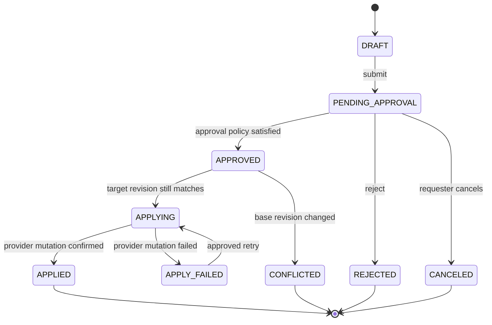
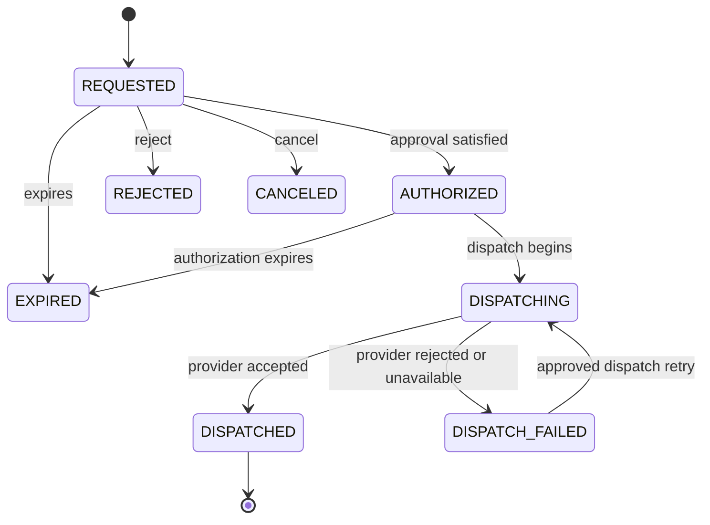
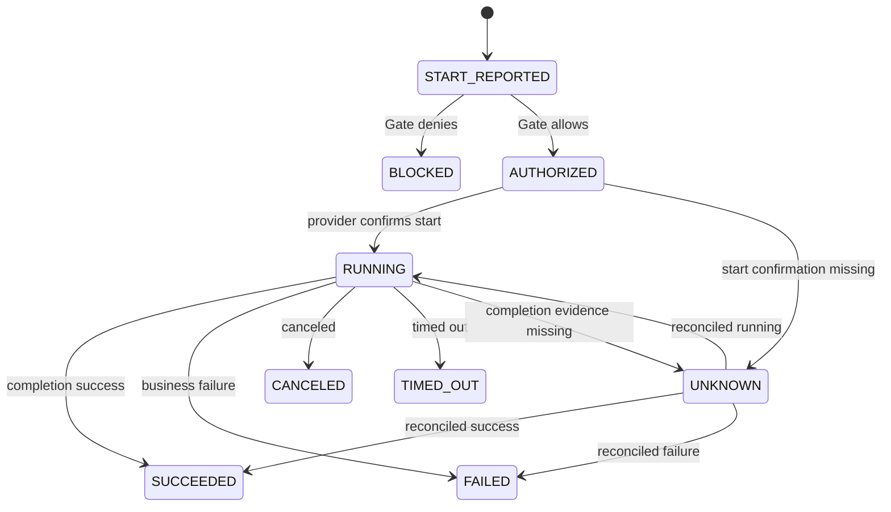
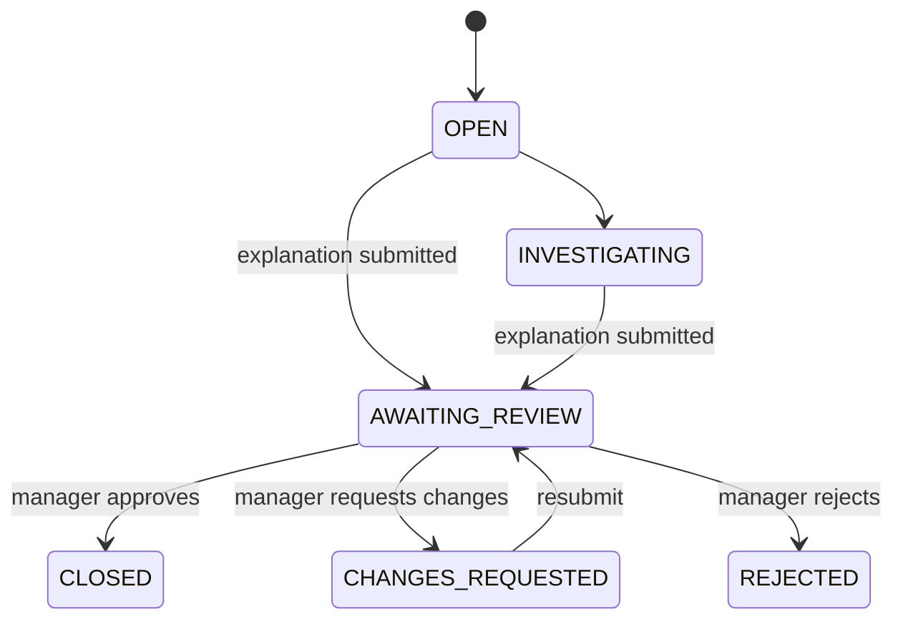

# BatchPlane Domain Model

Status: Architecture baseline for issue #191

## Modeling Principles

- Core types describe product meaning, not GitHub, Jenkins, or another
  provider's API resources.
- Request/approval, native mutation, execution authorization, execution
  attempt, and failure follow-up keep separate lifecycles.
- Cross-lifecycle correlation is explicit; there is no single giant workflow
  state machine.
- Historical decisions bind immutable revisions and policy snapshots.
- Provider-native values are represented through typed external references and
  schema-versioned provider specifications.

## Core Value Objects

| Value object           | Meaning                                              |
| ---------------------- | ---------------------------------------------------- |
| `WorkspaceId`          | Tenant and governance boundary                       |
| `PlatformConnectionId` | One configured provider installation or endpoint     |
| `ProviderKey`          | Stable extensible string such as `github-actions`    |
| `BatchId`              | Global product identifier inside a Workspace         |
| `BatchRevisionId`      | Immutable revision of governed Batch content         |
| `ExternalResourceRef`  | Provider key, connection, native type, and native ID |
| `RequestId`            | Governed change or execution-request correlation ID  |
| `ApprovalCaseId`       | Approval lifecycle identity                          |
| `PolicyRevisionId`     | Immutable policy evaluated for a decision            |
| `ExecutionIntentId`    | Requested manual/API/upstream execution identity     |
| `ExecutionPermitId`    | Short-lived authorization issued for Main execution  |
| `ExecutionAttemptId`   | One actual native start attempt                      |
| `NativeExecutionRef`   | Provider-native run/build/task ID and attempt        |
| `ScheduleId`           | Stable schedule identity owned by a Batch            |
| `ScheduleRevisionId`   | Approved immutable schedule revision                 |
| `FailureCaseId`        | Business-failure follow-up identity                  |
| `EvidenceRef`          | Native or product evidence locator and digest        |

Identifiers are opaque. A workflow file path, repository Issue number, Jenkins
Job full name, or native run ID MUST NOT be used as a core aggregate ID.

## Workspace Aggregate

```text
Workspace
  workspaceId
  name
  status
  membershipPolicy
  defaultApprovalPolicyId
  createdAt
```

A Workspace owns membership and policy references. Platform Connections are
separate aggregates so credential and health changes do not lock the Workspace
aggregate.

## Platform Connection Aggregate

```text
PlatformConnection
  platformConnectionId
  workspaceId
  providerKey
  displayName
  endpointDescriptor
  credentialRef
  providerVersion
  capabilities
  health
  enforcementCoverage
  configurationVersion
```

`endpointDescriptor` contains non-secret connection metadata. `credentialRef`
points to a secret-provider boundary. `capabilities` is provider-declared and
versioned. `enforcementCoverage` is one of:

- `PROTECTED`: verified pre-start Gate coverage for supported governed runs.
- `PARTIALLY_PROTECTED`: only some resource types or triggers are covered.
- `UNPROTECTED`: observation or management may work, but Gate is not enforced.
- `UNKNOWN`: installation or health has not been verified.

## Batch Aggregate

```text
Batch
  batchId
  workspaceId
  platformConnectionId
  externalResourceRef
  currentRevisionId
  lifecycleStatus
  governanceStatus
```

`BatchRevision` is immutable:

```text
BatchRevision
  batchRevisionId
  batchId
  revisionNumber
  name
  description
  ownerRef
  domain
  environment
  criticality
  labels
  executionProfile
  providerSpec
  schedules[]
  canonicalDigest
  createdBy
  createdAt
```

`executionProfile` contains provider-neutral execution metadata such as
parameter schema, timeout policy, concurrency policy, and sensitive-input
declarations. `providerSpec` is a provider-keyed, schema-versioned document.

Examples of provider-owned fields:

- GitHub Actions workflow path/ref, `runs-on`, command, and artifact path.
- Jenkins Job full name, parameters, node label, and configuration document.
- A future platform's deployment or Task reference.

Schedules are logically part of `BatchRevision`. Main MAY maintain relational
schedule projection tables for searching and occurrence processing.

## Governed Change Aggregate

```text
GovernedChangeRequest
  requestId
  workspaceId
  batchId
  operation: REGISTER | UPDATE | SUSPEND | RESTORE | DELETE
  baseRevisionId
  proposedRevision
  normalizedDiff
  providerChangePlan
  requester
  reason
  requestDigest
  approvalCaseId
  state
  applyResult
```

State machine:



Approval does not itself mean the provider mutation succeeded. `APPLIED` is the
only state that confirms effective native change.

## Approval Aggregate

```text
ApprovalCase
  approvalCaseId
  workspaceId
  subjectType
  subjectId
  subjectDigest
  policyRevisionId
  requestedBy
  state
  decisions[]
```

Each `ApprovalDecision` is immutable and includes principal, decision, role,
reason, timestamp, policy revision, subject digest, self-decision marker, and
evidence source.

The approval state is derived from policy and decisions. A provider-native PR
review or repository role is evidence consumed by an edition adapter; it is not
the core approval model.

## Execution Intent Aggregate

An Execution Intent represents a human, API, or upstream request that requires
explicit authorization.

```text
ExecutionIntent
  executionIntentId
  workspaceId
  batchId
  batchRevisionId
  triggerType: MANUAL | API | UPSTREAM
  requestedBy
  requestedAt
  expiresAt
  reason
  parameterBindings
  parameterDigest
  requestDigest
  approvalCaseId
  state
```

State machine:



The execution result is not part of this state machine. It belongs to
`ExecutionAttempt`.

## Schedule Authority

Scheduled execution does not fabricate an Execution Intent or human approval
for each occurrence.

```text
ScheduleRevision
  scheduleRevisionId
  scheduleId
  batchRevisionId
  cron
  timezone
  enabled
  overlapPolicy
  misfirePolicy
  effectiveFrom
  effectiveUntil
  approvalEvidenceRef
  canonicalDigest
```

The native schedule trigger supplies a `ScheduledOccurrenceRef` containing
provider, schedule identity, native scheduled time, and native execution
identity. Gate resolves the currently effective approved Schedule Revision.

```text
ScheduledOccurrenceRef
  scheduleRevisionId
  providerOccurrenceKey
  expectedAt
  observedAt
  nativeExecutionRef
  deliveryEvidenceRef
```

`providerOccurrenceKey` is stable when the provider exposes one. Otherwise the
adapter derives a documented key from the Schedule Revision and native
execution identity. `expectedAt` may be absent when a provider reports only an
observed native occurrence. Provider delay is represented by the difference
between `expectedAt` and `observedAt`; it does not create a new approval.

## Execution Permit

Main MAY issue an Execution Permit before dispatch or resolve authorization at
the first start boundary. A permit is not a bearer approval record and must be
single-consumption and scope-bound.

```text
ExecutionPermit
  executionPermitId
  workspaceId
  platformConnectionId
  batchId
  batchRevisionId
  authorityType: EXECUTION_INTENT | SCHEDULE_REVISION | BREAK_GLASS
  authorityId
  parameterDigest
  issuedAt
  expiresAt
  consumedAt
  state
```

## Execution Attempt Aggregate

```text
ExecutionAttempt
  executionAttemptId
  workspaceId
  platformConnectionId
  batchId
  batchRevisionId
  nativeExecutionRef
  triggerType: MANUAL | API | UPSTREAM | SCHEDULE | NATIVE
  authorityRef
  gateDecision
  state
  startedAt
  completedAt
  outcome
  nativeEvidenceRefs[]
```

State machine:



`BLOCKED` means business work did not start. `FAILED` means Gate allowed the
attempt and downstream business execution failed.

## Failure Case Aggregate

```text
FailureCase
  failureCaseId
  executionAttemptId
  causeCategory
  explanation
  actionTaken
  owner
  status
  submittedBy
  submittedAt
  reviewDecisions[]
```

State machine:



The initial explanation and every manager decision remain immutable evidence.
Corrections create a new submission rather than editing historical records.

## Audit Event

Audit Event is append-only evidence, not an aggregate used to decide current
state.

```text
AuditEvent
  eventId
  eventVersion
  workspaceId
  occurredAt
  recordedAt
  actorRef
  action
  subjectRef
  outcome
  reasonCode
  correlationIds
  beforeDigest
  afterDigest
  evidenceRefs[]
  metadata
```

Current state is stored in domain tables; Audit Event records how that state was
reached. BatchPlane does not require full event sourcing for the initial Main
architecture.

## Correlation Rules

- Change Request correlates approval, provider mutation, resulting Batch
  revision, and audit events.
- Execution Intent correlates approval, dispatch, native execution, Gate, and
  resulting attempts.
- Schedule Revision correlates every native scheduled occurrence and attempt.
- Execution Attempt correlates Gate decision, provider start/end evidence,
  logs, and failure follow-up.
- Native identifiers are never assumed globally unique; they are scoped by
  Platform Connection and provider.
